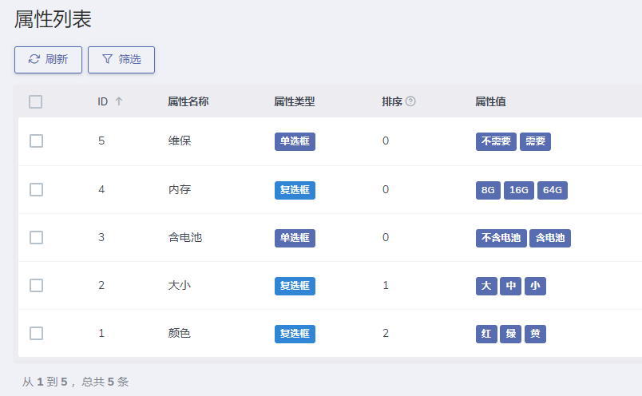
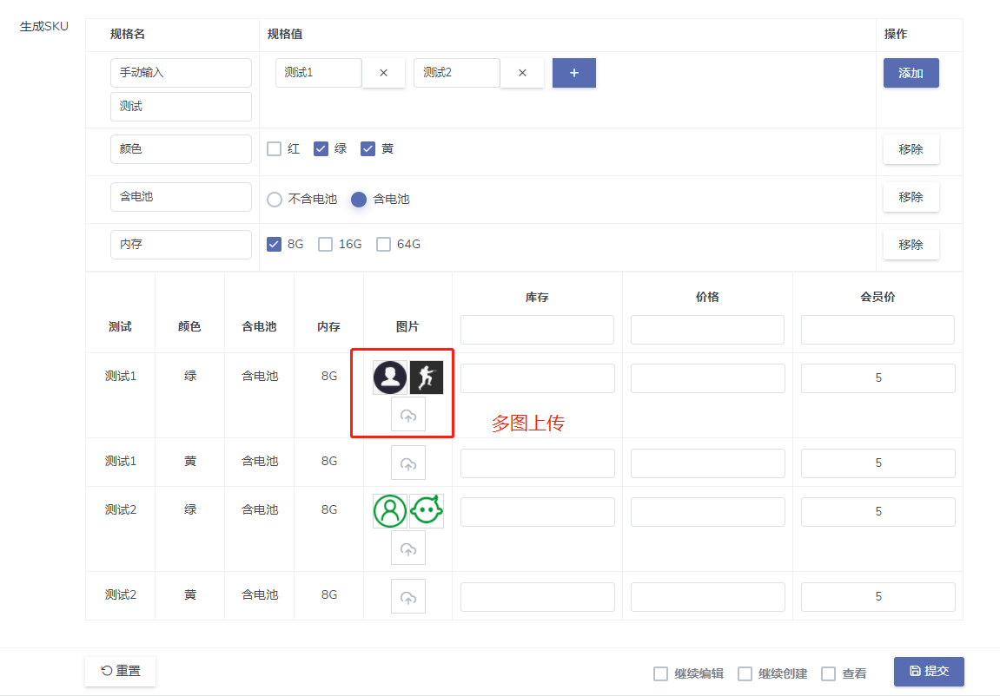
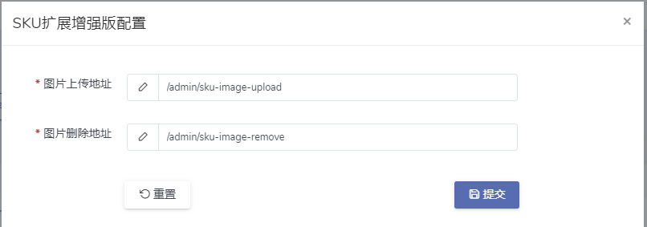

# Dcat Admin SKU扩展增强版

> 首先感谢前人的肩膀：https://github.com/lty5240/dcat-easy-sku
>
> 以及前人的前人的肩膀：https://github.com/jade-kun/sku
>
> 因改动太大，故没有往前面两位大佬的仓库中PR。

### **如果感觉好用，还请给个`Star`鼓励一下，谢谢 :beers: 。**

该插件是 [Dcat Admin](https://learnku.com/docs/dcat-admin/) 的插件，安装方式遵循Dcat Admin官方文档。

默认规格带有`图片`、`库存`、`价格`三个属性，可自行添加属性，自行处理。

## 改进的地方

- 增加了独立设置相关属性的模块；
- 增加了多图上传功能；
- 增加删除图片时操作确认；
- 增加删除图片时同时删除后端图片；
- 增加图片上传、删除的URL配置项，不用再去修改js文件中的相关变量；

## 界面展示

* 可以独立设置规格属性，默认`输入框`，支持`单选框`和`复选框`。

<div align="center">



</div>

* 在表单界面规格名位置选择下拉框中的相关属性或者手动输入，生成SKU相关信息。
  <div align="center">

  

  </div>

* 插件配置页面可以配置图片上传、删除的URL。
  <div align="center">

  

  </div>

## 安装

#### composer安装

```shell
composer require abbotton/dcat-sku-plus
```

#### 应用商店安装

``` 
等待Dcat Admin 上商店 
```

## 使用

```php
// app/Admin/Controllers/ProductController.php

protected function form()
{
    return Form::make(new Product(), function (Form $form) {
        $skuParams = [
            // 扩展第一列
            [
                'name'    => '会员价', // table 第一行 title
                'field'   => 'member_price', // input 的 field_name 名称
                'default' => 5, // 默认值
            ],
            // 扩展第二列
        ];
        // 新增时
        $form->sku('sku', '生成SKU')->addColumn($skuParams);
        
        // 编辑时
        $skuData = []; // 数据结构见附录
        $skuString = json_encode($skuData);
        $form->sku('sku', '生成SKU')->addColumn($skuParams)->value($skuString);
        
        // 获取提交的数据.
        $form->saving(function (Form $form) {
            // 拿到SKU数据，按照业务逻辑做响应处理即可。
            dd($form->input('sku'));
        });
    });
}
```

## 附录

#### 最终生成的SKU数据结构，仅供参考

```json
{
  "attrs": {
    "测试": [
      "测试1",
      "测试2"
    ],
    "颜色": [
      "绿",
      "黄"
    ],
    "含电池": [
      "含电池"
    ],
    "内存": [
      "8G"
    ]
  },
  "sku": [
    {
      "测试": "测试1",
      "颜色": "绿",
      "含电池": "含电池",
      "内存": "8G",
      "pic": [
        {
          "short_url": "sku/HjdrG0RpfIwI3kkgpNNFfmxPasgaOLg6bBPOCDxd.jpg",
          "full_url": "http://127.0.0.1:8000/storage/sku/HjdrG0RpfIwI3kkgpNNFfmxPasgaOLg6bBPOCDxd.jpg"
        },
        {
          "short_url": "sku/bkucABLjzRQ5pEHYX0gwdS1VxJrS6ObiQCIWVvIl.png",
          "full_url": "http://127.0.0.1:8000/storage/sku/bkucABLjzRQ5pEHYX0gwdS1VxJrS6ObiQCIWVvIl.png"
        }
      ],
      "stock": "",
      "price": "",
      "member_price": 5
    }
  ]
}
```